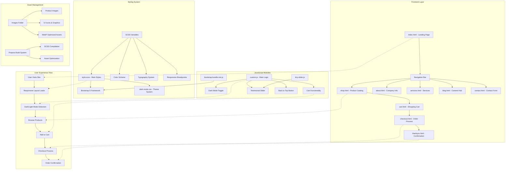
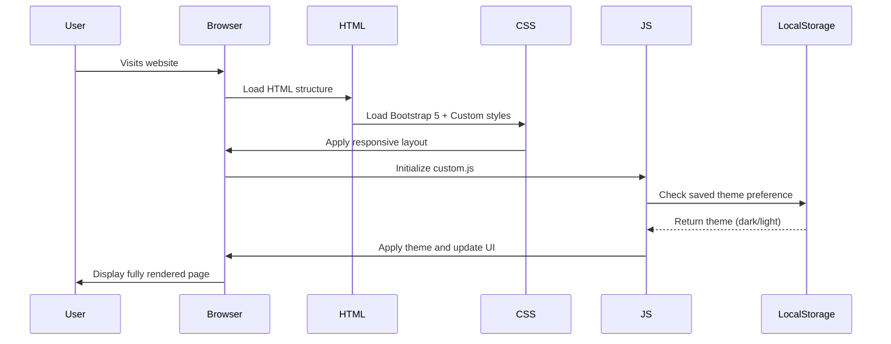
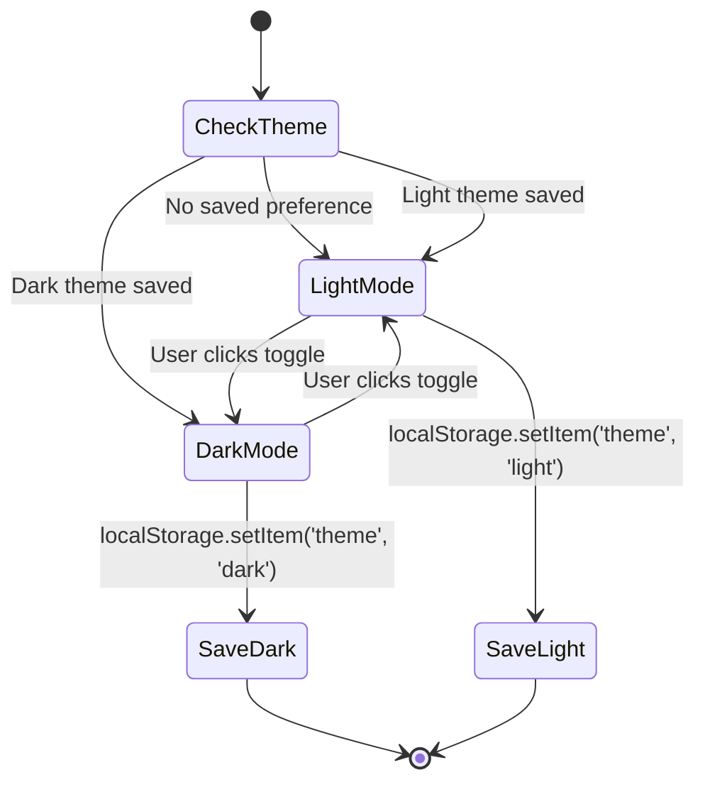
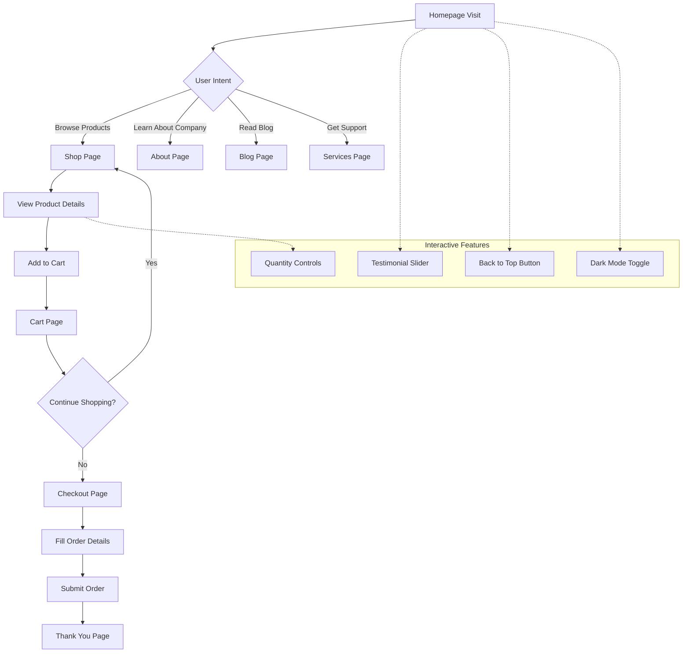
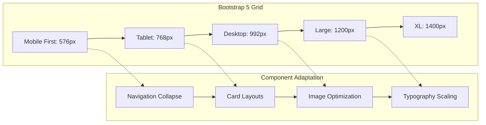

# 🪑 Furni - Modern Furniture E-Commerce Template

[](https://getbootstrap.com/)
[](https://creativecommons.org/licenses/by/3.0/)
[](https://developer.mozilla.org/en-US/docs/Web/HTML)
[](https://sass-lang.com/)
[](https://developer.mozilla.org/en-US/docs/Web/JavaScript)

A modern, responsive furniture e-commerce website template built with Bootstrap 5, featuring dark mode toggle, image optimization, and seamless user experience across all devices.

---

## 📘 Project Overview

### 🎯 Goals
Furni is designed to provide a **complete e-commerce solution** for furniture retailers, featuring:
- **Modern, clean design** that showcases furniture products effectively
- **Responsive layout** that works seamlessly across desktop, tablet, and mobile devices
- **Dark/Light theme switching** for enhanced user experience
- **Performance optimization** with image optimization and efficient loading
- **Accessibility compliance** with ARIA labels and keyboard navigation

### ✨ Core Features
- 🌙 **Dark/Light Mode Toggle** - Persistent theme switching with localStorage
- 🛒 **E-Commerce Flow** - Complete shopping experience (browse → cart → checkout → confirmation)
- 📱 **Responsive Design** - Mobile-first approach with Bootstrap 5 grid system
- 🖼️ **Image Optimization** - WebP format support with fallbacks
- 🔄 **Interactive Components** - Testimonial sliders, quantity controls, smooth scrolling
- ♿ **Accessibility Features** - ARIA labels, keyboard navigation, screen reader support
- ⚡ **Performance Optimized** - Lazy loading, optimized assets, minimal JavaScript

### 🎨 Use Cases
- **Furniture Store Websites** - Complete template for online furniture retailers
- **Interior Design Portfolios** - Showcase furniture and design services
- **E-Commerce Prototyping** - Rapid development of shopping experiences
- **Bootstrap Learning** - Educational template demonstrating modern web practices

---

## 🧩 Architecture Diagram



---

## 🔄 Component Interaction Flow

### 1. **Page Load & Initialization**


### 2. **Dark Mode Toggle Workflow**


### 3. **E-Commerce User Journey**


### 4. **Responsive Design System**


---

## 🖼️ Visual Reference Alignment

The architecture diagram above represents the complete system design matching the intended furniture e-commerce experience:

- **Frontend Layer**: Nine interconnected HTML pages forming the complete user journey
- **Styling System**: SCSS-based design system with Bootstrap 5 integration
- **JavaScript Modules**: Modular functionality for interactivity and user experience
- **Asset Management**: Optimized image delivery and build process
- **User Experience Flow**: Linear progression from landing to purchase confirmation

This design ensures **scalability**, **maintainability**, and **performance** while providing an intuitive user experience.

---

## ⚙️ Technical Details

### 🛠️ Technology Stack
- **Frontend Framework**: Bootstrap 5.0+
- **Styling**: SCSS with custom design system
- **JavaScript**: Vanilla JS with IIFE pattern
- **Icons**: Font Awesome 6.0
- **Build System**: Prepros 6 for SCSS compilation
- **Image Optimization**: WebP with JPG/PNG fallbacks

### 📦 Dependencies
```html
<!-- CSS Dependencies -->
<link href="css/bootstrap.min.css" rel="stylesheet">
<link href="https://cdnjs.cloudflare.com/ajax/libs/font-awesome/6.0.0-beta3/css/all.min.css" rel="stylesheet">
<link href="css/tiny-slider.css" rel="stylesheet">
<link href="css/style.css" rel="stylesheet">
<link href="css/dark-mode.css" rel="stylesheet">

<!-- JavaScript Dependencies -->
<script src="js/bootstrap.bundle.min.js"></script>
<script src="js/tiny-slider.js"></script>
<script src="js/custom.js"></script>
```

### 🚀 Quick Setup

1. **Clone the repository**
   ```bash
   git clone https://github.com/sivolko/dryrun.git
   cd dryrun
   ```

2. **Serve locally**
   ```bash
   # Using Python 3
   python3 -m http.server 8000
   
   # Using Node.js (if you have serve installed)
   npx serve .
   
   # Using PHP
   php -S localhost:8000
   ```

3. **Open in browser**
   ```
   http://localhost:8000
   ```

### 🎨 Design System Configuration

**Color Scheme (SCSS Variables)**
```scss
$primary: #3b5d50;    // Forest Green
$secondary: #f9bf29;  // Golden Yellow
$dark: #2f2f2f;       // Charcoal
$light: #dce5e4;      // Light Mint
$lighter: #eff2f1;    // Very Light Mint
$body_color: #6a6a6a; // Medium Gray
```

**Responsive Breakpoints**
```scss
$sm: 576px;   // Small devices
$md: 768px;   // Medium devices
$lg: 992px;   // Large devices
$xl: 1200px;  // Extra large devices
$xxl: 1400px; // Extra extra large devices
```

### 🏗️ Project Structure
```
furni/
├── 📄 HTML Pages
│   ├── index.html      # Landing page
│   ├── shop.html       # Product catalog
│   ├── about.html      # Company information
│   ├── services.html   # Service offerings
│   ├── blog.html       # Content hub
│   ├── contact.html    # Contact form
│   ├── cart.html       # Shopping cart
│   ├── checkout.html   # Order process
│   └── thankyou.html   # Confirmation page
├── 🎨 Styles
│   ├── css/
│   │   ├── bootstrap.min.css
│   │   ├── style.css
│   │   ├── dark-mode.css
│   │   └── tiny-slider.css
│   └── scss/
│       └── style.scss
├── ⚡ Scripts
│   ├── js/
│   │   ├── bootstrap.bundle.min.js
│   │   ├── custom.js
│   │   └── tiny-slider.js
├── 🖼️ Assets
│   └── images/
│       ├── product-*.png
│       ├── person-*.jpg
│       └── *.svg icons
└── 📋 Configuration
    └── prepros-6.config
```

### 🔧 Development Workflow

1. **SCSS Development**
   ```bash
   # Watch SCSS files (using Prepros or equivalent)
   # Compile scss/style.scss → css/style.css
   ```

2. **Image Optimization**
   ```bash
   # Convert images to WebP format (recommended)
   # Maintain JPG/PNG fallbacks for compatibility
   ```

3. **Testing Checklist**
   - [ ] Responsive design on all breakpoints
   - [ ] Dark/Light mode functionality
   - [ ] Cart operations (add, remove, quantity)
   - [ ] Form submissions
   - [ ] Cross-browser compatibility

### 🚀 Performance Optimization

**Image Loading Strategy**
```html
<!-- WebP with fallback -->
<picture>
  <source srcset="images/product-1.webp" type="image/webp">
  
</picture>
```

**Critical CSS Inlining**
- Inline critical CSS for above-the-fold content
- Defer non-critical stylesheets

**JavaScript Optimization**
- Use IIFE pattern for module encapsulation
- Minimize DOM queries
- Implement lazy loading for images

### 📊 Performance Metrics
- **Lighthouse Score Target**: 90+ (Performance, Accessibility, Best Practices, SEO)
- **Core Web Vitals**: All metrics in "Good" range
- **Image Optimization**: 40%+ size reduction with WebP
- **Load Time**: < 3 seconds on 3G connection

### 🌐 Browser Support
- **Modern Browsers**: Chrome 90+, Firefox 88+, Safari 14+, Edge 90+
- **Mobile**: iOS Safari 14+, Android Chrome 90+
- **Features**: CSS Grid, Flexbox, Custom Properties, ES6

### 🤝 Contributing

1. **Fork the repository**
2. **Create a feature branch**
   ```bash
   git checkout -b feature/your-feature-name
   ```
3. **Make your changes**
4. **Test thoroughly**
   - Check responsive design
   - Validate HTML/CSS
   - Test JavaScript functionality
5. **Submit a pull request**

### 📝 Code Style Guidelines

**HTML**
- Use semantic HTML5 elements
- Include proper ARIA labels
- Maintain consistent indentation (2 spaces)

**CSS/SCSS**
- Follow BEM methodology for class naming
- Use meaningful class names
- Maintain consistent spacing and formatting

**JavaScript**
- Use IIFE pattern for encapsulation
- Include JSDoc comments for functions
- Follow camelCase naming convention

### 📄 License
This project is licensed under [Creative Commons Attribution 3.0](https://creativecommons.org/licenses/by/3.0/) - see the [LICENSE](LICENSE) file for details.

### 🙏 Acknowledgments
- **Bootstrap Team** for the excellent CSS framework
- **Untree.co** for the original template design
- **Font Awesome** for the comprehensive icon library
- **Tiny Slider** for the carousel functionality

---

## 📞 Support & Contact

- **Issues**: [GitHub Issues](https://github.com/sivolko/dryrun/issues)
- **Discussions**: [GitHub Discussions](https://github.com/sivolko/dryrun/discussions)
- **Email**: [Contact Form](contact.html)

---

*Last Updated: September 2024 | Version: 1.0.0 | Maintainer: @sivolko*
